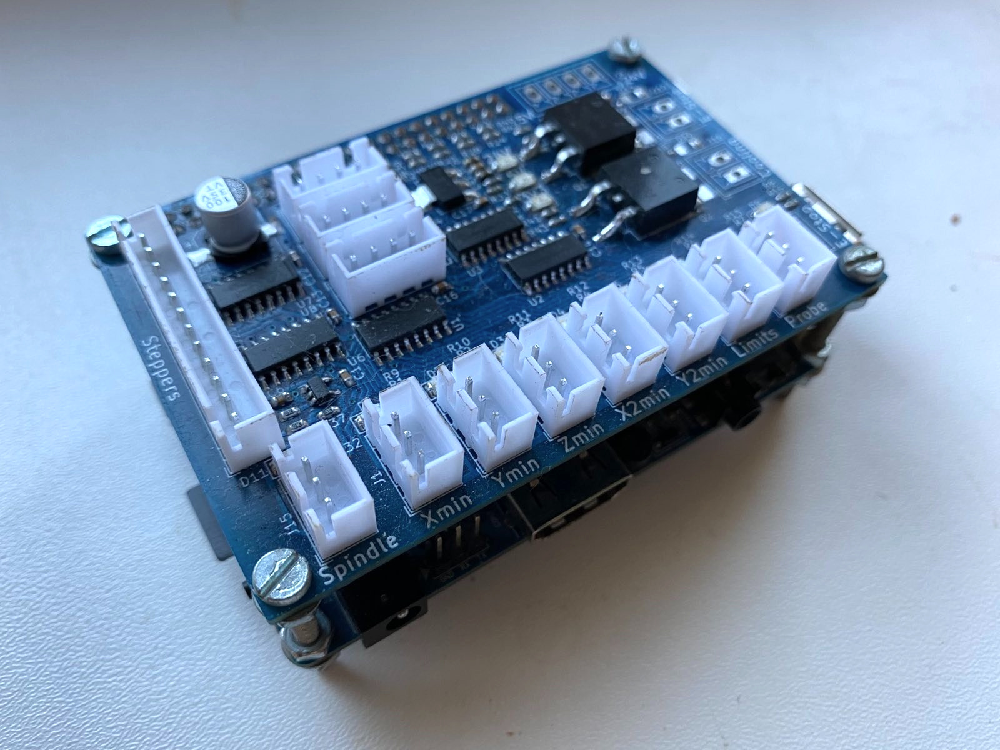

# LinuxCNC Shield for OrangePi

This repo contains a HW design files for OrangePi CNC shield for making the
OrangePi a LinuxCNC machine.

The [allwincnc](https://allwincnc.github.io/) project can be used to do the
realtime heavy lifting (stepper control) while the OrangePi does the slower
tasks (kinematics calculations,...).

More details about making this all work with a real CNC machine can be found
on [my blog](https://deadbadger.cz/projects/linuxcnc-on-orangepi)

## Features
* 5 stepper controllers (direction and step signals) supported
* 3 encoders inputs
* Spindle control - both PWM and 0-10 V outputs
* 6 limit switches (endstops, home position,...)
* Probe sensor input
* Stop button input
* 2 power outputs (cooling, ESTOP,...), up to 24 V
* Incidator leds on inputs and outputs for easier debugging
* Up to 15 V inputs protection
* Selectable 3.3/5 V power for limit switches
* OrangePi can be powered directly from the board (dedicated 5 V input) and vice versa.

## Connectors
### J21 Steppers
| Pin | Signal |
|-----|--------|
| 1 | GND |
| 2 | ~Enable |
| 3 | Y2 dir |
| 4 | Y2 step |
| 5 | X2 dir |
| 6 | X2 step |
| 7 | Z dir |
| 8 | Z step |
| 9 | Y dir |
| 10 | Y step |
| 11 | X dir |
| 12 | X step |

### J15 spindle
| Pin | Signal |
|-----|--------|
| 1 | GND |
| 2 | 0-10 V |
| 3 | PWM |

### J11, J12, J13 Encoders
| Pin | Signal |
|-----|--------|
| 1 | GND |
| 2 | B |
| 3 | A |
| 4 | 5 V |

### J1-J7 Inputs
| Pin | Signal |
|-----|--------|
| 1 | 5/3.3 V |
| 2 | GND |
| 3 | signal (with pull-up) |

## OrangePi Pinout

### Steppers
|      | X    | Y    | Z    | X2   | Y2   |
| :--  | :--: | :--: | :--: | :--: | :--: |
| Step | PA0  | PA12 | PA13 | PC4  | PA14 |
| Dir  | PA6  | PA1  | PA11 | PD14 | PC7  |

### Encoders
|      | X    | Y    | Z    |
| :--  | :--: | :--: | :--: |
| A    | PA8  | PA18 | PC2  |
| B    | PA9  | PG9  | PA21 |

### Limit switches
| Xmin | Ymin | Zmin | X2min| Y2min| Limits |
| :--: | :--: | :--: | :--: | :--: | :--:   |
| PA2  | PC1  | PA19 | PA7  | PG8  | PC3    |

### Others
| Enable | Spindle | Cooling | Probe | ESTOP in | ESTOP out |
| :--: | :--: | :--: | :--: | :--: | :--:   |
| PA3  | PC0  | PG7 | PA10  | PA20  | PG6   |

